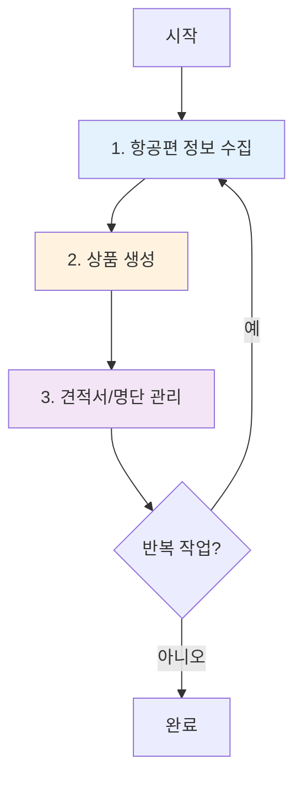
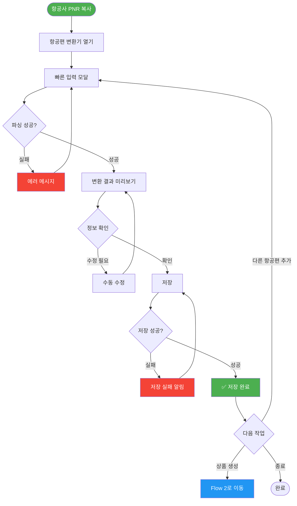
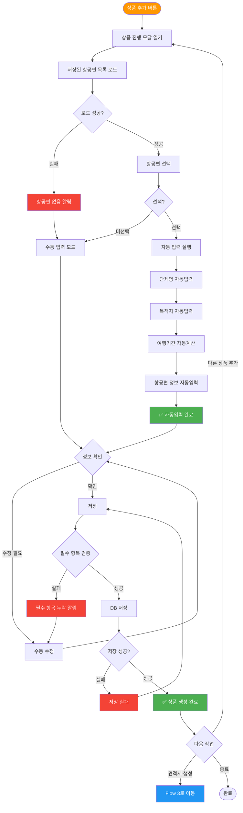
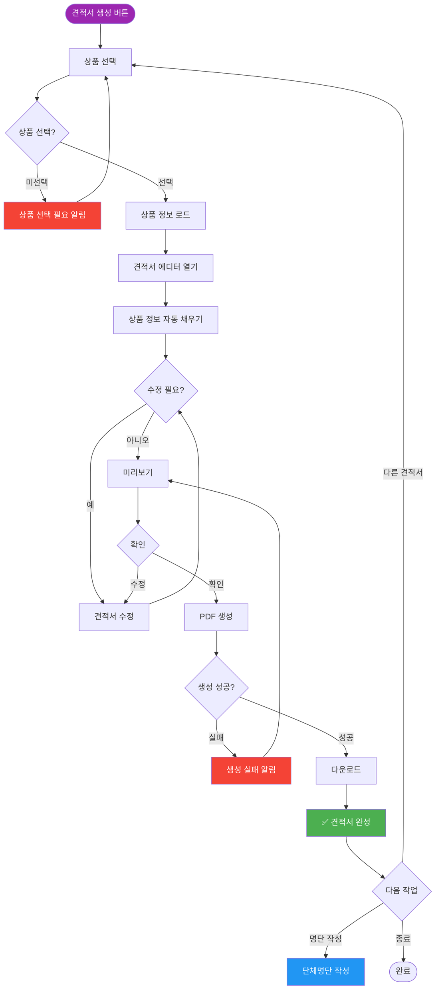
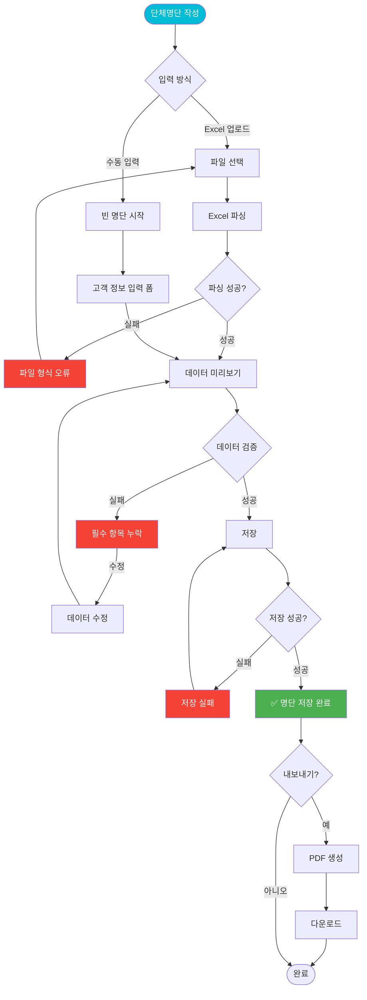
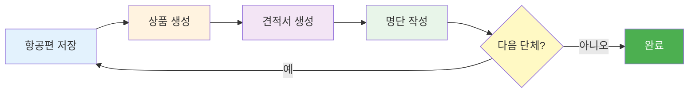

# 여행사 관리 시스템 - User Flow

**Version:** v1.0
**Last Updated:** 2025-12-29
**작성자:** System Analysis

---

## 🎯 핵심 업무 플로우 (3단계)



---

## 📋 Flow 1: 항공편 정보 수집 및 저장

### 시작점: 항공사 예약 시스템에서 데이터 복사



### 성공 조건
- ✅ PNR 올바르게 추출
- ✅ 항공편 번호, 날짜, 시간 파싱 성공
- ✅ localStorage에 저장 완료

### 실패 분기
- ❌ PNR 형식 불일치 → 에러 메시지 + 재입력
- ❌ 날짜/시간 파싱 실패 → 수동 수정 필요
- ❌ 저장 실패 → 재시도

---

## 🎫 Flow 2: 상품 생성 (자동입력)

### 시작점: 상품 관리 → 신규 상품 추가



### 성공 조건
- ✅ 항공편 선택 시 자동입력 작동
- ✅ 필수 항목 (단체명, 목적지, 기간, 가격) 모두 입력
- ✅ 저장 완료

### 실패 분기
- ❌ 항공편 없음 → 수동 입력 모드
- ❌ 필수 항목 누락 → 경고 메시지
- ❌ 저장 실패 → 재시도

### 자동입력 항목
1. **단체명**: `flight.name`
2. **목적지**: `flight.flights[0].arrival.airport`
3. **여행기간**: 출발일~귀국일 계산 (일수)
4. **항공사**: `flight.airline`
5. **출발편**: `항공편명 출발지 시간 → 도착지 시간`
6. **귀국편**: 왕복인 경우 자동 추가

---

## 📄 Flow 3: 견적서 생성

### 시작점: 상품 선택 → 견적서 생성



### 성공 조건
- ✅ 상품 정보 정확히 로드
- ✅ PDF 생성 성공
- ✅ 다운로드 완료

### 실패 분기
- ❌ 상품 미선택 → 선택 요청
- ❌ PDF 생성 실패 → 재시도
- ❌ 다운로드 실패 → 재다운로드

---

## 👥 Flow 4: 단체명단 관리

### 시작점: 단체명단 → 신규 작성



### 성공 조건
- ✅ Excel 파일 정상 파싱 또는 수동 입력 완료
- ✅ 필수 항목 (이름, 생년월일, 여권번호) 검증 통과
- ✅ 저장 완료

### 실패 분기
- ❌ Excel 형식 오류 → 재업로드
- ❌ 필수 항목 누락 → 수정 요청
- ❌ 저장 실패 → 재시도

---

## 🔄 Sticky Loop (반복 사용 유도)

### 핵심 반복 패턴



### Loop 강화 요소
1. **빠른 재시작**: 저장 완료 후 "다음 단체 추가" 버튼
2. **템플릿 재사용**: 이전 상품 복사 기능
3. **최근 항목 표시**: 대시보드에 최근 작업 위젯
4. **진행 상태 표시**: 단계별 완료 체크마크

---

## ⚠️ 공통 에러 처리

### 에러 분류 및 대응

| 에러 유형 | 원인 | 대응 방법 |
|---------|------|----------|
| **파싱 실패** | PNR 형식 불일치 | 형식 가이드 표시 + 재입력 |
| **필수 항목 누락** | 입력 누락 | 빨간색 테두리 + 포커스 이동 |
| **저장 실패** | localStorage 용량 초과 | 오래된 데이터 삭제 제안 |
| **파일 업로드 실패** | 형식 오류 | 샘플 파일 다운로드 제공 |
| **PDF 생성 실패** | 브라우저 호환성 | 다른 브라우저 사용 권장 |

---

## 📊 성공 지표 (KPI)

### 각 Flow별 성공률 측정

```
Flow 1 (항공편 저장):
  성공: 파싱 성공 → 저장 완료
  목표: 95% 이상

Flow 2 (상품 생성):
  성공: 자동입력 → 저장 완료
  목표: 90% 이상 (자동입력 활용률)

Flow 3 (견적서):
  성공: PDF 생성 → 다운로드
  목표: 98% 이상

Flow 4 (명단):
  성공: Excel 업로드 → 저장 완료
  목표: 85% 이상
```

---

## 🔍 실험-학습 루프

### 현재 가설
1. **가설**: 항공편 자동입력으로 입력 시간 50% 단축
   - **실험**: 자동입력 vs 수동입력 시간 측정
   - **관측**: 사용자 행동 패턴 분석
   - **학습**: 어떤 필드가 가장 많이 수정되는가?
   - **다음**: 수정 많은 필드는 자동입력 로직 개선

2. **가설**: Sticky Loop 강화로 재사용률 증가
   - **실험**: "다음 단체 추가" 버튼 추가
   - **관측**: 연속 작업 횟수 측정
   - **학습**: 어디서 이탈하는가?
   - **다음**: 이탈 지점에 가이드 추가

---

## 🚀 다음 개선 포인트

### Phase 2 (우선순위 높음)
- [ ] 자동 백업 기능 (localStorage → Cloud)
- [ ] 상품 템플릿 저장/불러오기
- [ ] 일괄 작업 (여러 견적서 동시 생성)

### Phase 3 (백로그)
- [ ] 모바일 최적화
- [ ] 실시간 협업 (여러 사용자)
- [ ] AI 기반 가격 추천

---

## 📝 버전 히스토리

### v1.0 (2025-12-29)
- ✅ 핵심 플로우 4개 정의
- ✅ 성공/실패 분기 명시
- ✅ Sticky Loop 구성
- ✅ 에러 처리 가이드
- ✅ 실험-학습 루프 설계

---

**작성 완료일**: 2025-12-29
**다음 리뷰**: 사용자 피드백 후 업데이트
