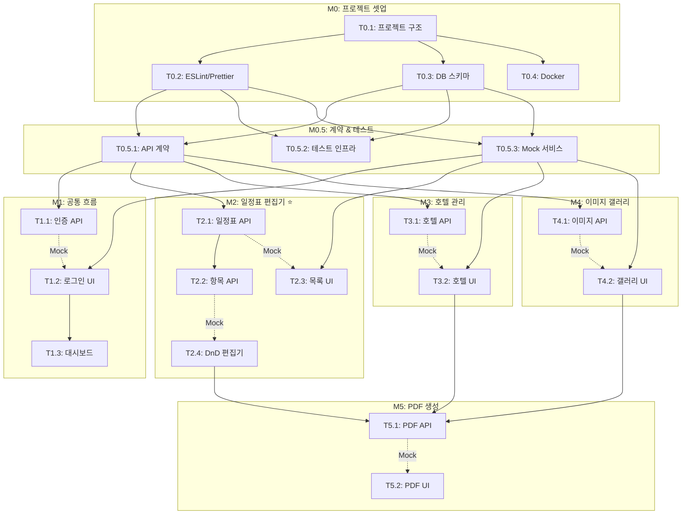

# TASKS: Travel World CMS - AI 개발 파트너용 태스크 목록

## MVP 캡슐

| # | 항목 | 내용 |
|---|------|------|
| 1 | **목표** | 여행 데이터 입력 → PDF 브로슈어 출력 올인원 도구 |
| 2 | **페르소나** | 여행사 대표/관리자 |
| 3 | **핵심 기능** | FEAT-2: 일정표 편집기 (드래그앤드롭) |
| 4 | **성공 지표** | 브로슈어 제작 시간 30분 → 5분 이내 |
| 5 | **입력 지표** | 월간 브로슈어 발행 건수, 평균 제작 시간 |
| 6 | **비기능 요구** | 데스크톱 웹 전용, 하이브리드 저장 (로컬+클라우드) |
| 7 | **Out-of-scope** | 모바일 앱, 결제 시스템, 외부 판매 |
| 8 | **Top 리스크** | 드래그앤드롭 UI 구현 복잡도 |
| 9 | **완화 방안** | React-DnD 라이브러리 활용 |
| 10 | **다음 단계** | M0 프로젝트 셋업 → M2 일정표 편집기 프로토타입 |

---

## 마일스톤 개요

| 마일스톤 | Phase | 설명 | 주요 산출물 |
|----------|-------|------|------------|
| M0 | 0 | 프로젝트 셋업 | 프로젝트 구조, 개발환경, DB 스키마 |
| M0.5 | 0 | 계약 & 테스트 기반 | API 계약, 테스트 인프라, Mock 설정 |
| M1 | 1 | FEAT-0 공통 흐름 | 인증, 대시보드, 공통 레이아웃 |
| M2 | 2 | FEAT-2 일정표 편집기 ⭐ | 드래그앤드롭 편집기, CRUD API |
| M3 | 3 | FEAT-1 호텔 관리 | 호텔 CRUD, 지도 연동 |
| M4 | 4 | FEAT-3 이미지 갤러리 | 이미지 업로드, 카테고리 관리 |
| M5 | 5 | PDF 브로슈어 생성 (v2) | PDF 템플릿, 인쇄 출력 |

---

## M0: 프로젝트 셋업 ✅ 완료

### [x] Phase 0, T0.1: 프로젝트 구조 초기화 ✅

**담당**: frontend-specialist

**작업 내용**:
- Monorepo 구조 생성 (client/, server/, shared/)
- React + Vite + TypeScript 프론트엔드 초기화
- Express.js + TypeScript 백엔드 초기화
- 공유 타입 패키지 설정

**산출물**:
- `client/` - React 프론트엔드
- `server/` - Express 백엔드
- `shared/` - 공유 타입
- `package.json` (루트)

**완료 조건**:
- [x] `npm install` 성공
- [x] `npm run dev` 로 client/server 동시 실행 가능
- [x] TypeScript 컴파일 에러 없음

---

### [x] Phase 0, T0.2: ESLint + Prettier 설정 ✅

**담당**: frontend-specialist

**작업 내용**:
- ESLint 설정 (TypeScript, React 규칙)
- Prettier 설정 (코드 포맷팅)
- Git Hooks (Husky + lint-staged)
- VS Code 설정 공유

**산출물**:
- `.eslintrc.js`
- `.prettierrc`
- `.husky/`
- `.vscode/settings.json`

**완료 조건**:
- [x] `npm run lint` 실행 가능
- [x] 커밋 시 자동 lint 검사
- [x] 저장 시 자동 포맷팅

---

### [x] Phase 0, T0.3: 데이터베이스 스키마 설정 ✅

**담당**: database-specialist

**작업 내용**:
- PostgreSQL 연결 설정
- 마이그레이션 도구 설정 (Prisma 또는 Knex)
- 초기 스키마 생성 (users, itineraries, hotels, images)
- 시드 데이터 준비

**산출물**:
- `server/prisma/schema.prisma` (또는 migrations/)
- `server/prisma/seed.ts`
- `server/src/config/database.ts`

**완료 조건**:
- [x] DB 연결 성공
- [x] 마이그레이션 실행 가능
- [x] 시드 데이터 삽입 성공

---

### [x] Phase 0, T0.4: Docker 개발환경 설정 ✅

**담당**: backend-specialist

**작업 내용**:
- docker-compose.yml 생성 (PostgreSQL, 개발서버)
- .env 파일 템플릿
- 개발/프로덕션 환경 분리

**산출물**:
- `docker-compose.yml`
- `docker-compose.dev.yml`
- `.env.example`
- `Dockerfile` (server, client)

**완료 조건**:
- [x] `docker-compose up` 으로 전체 환경 실행
- [x] PostgreSQL 컨테이너 정상 동작
- [x] Hot Reload 동작

---

## M0.5: 계약 & 테스트 기반 ✅ 완료

### [x] Phase 0, T0.5.1: API 계약 정의 ✅

**담당**: backend-specialist

**작업 내용**:
- OpenAPI (Swagger) 스펙 작성
- API 요청/응답 타입 정의 (shared/)
- 에러 응답 형식 표준화

**산출물**:
- `shared/types/api.ts` - API 타입
- `shared/types/models.ts` - 모델 타입
- `server/docs/openapi.yaml` - API 스펙

**완료 조건**:
- [x] 모든 엔드포인트 타입 정의 완료
- [x] Swagger UI로 API 문서 확인 가능
- [x] 프론트/백엔드 타입 공유 설정

---

### [x] Phase 0, T0.5.2: 테스트 인프라 설정 ✅

**담당**: frontend-specialist

**작업 내용**:
- Vitest 설정 (프론트엔드)
- Jest/Supertest 설정 (백엔드)
- 테스트 커버리지 리포트 설정
- CI/CD 테스트 파이프라인

**산출물**:
- `client/vitest.config.ts`
- `server/jest.config.ts`
- `.github/workflows/test.yml`

**완료 조건**:
- [x] `npm run test` 실행 가능
- [x] 커버리지 리포트 생성
- [x] PR 시 자동 테스트 실행

---

### [x] Phase 0, T0.5.3: Mock 서비스 설정 ✅

**담당**: frontend-specialist

**작업 내용**:
- MSW (Mock Service Worker) 설정
- 테스트용 Mock 데이터 생성
- 백엔드 없이 프론트 개발 가능하도록 설정

**산출물**:
- `client/src/mocks/handlers.ts`
- `client/src/mocks/data/`
- `client/src/mocks/browser.ts`

**완료 조건**:
- [x] MSW로 API 모킹 동작
- [x] 개발 모드에서 Mock 데이터 사용 가능
- [x] 테스트에서 Mock 사용 가능

---

## M1: FEAT-0 공통 흐름 ✅ 완료

### [x] Phase 1, T1.1: JWT 인증 API RED→GREEN ✅

**담당**: backend-specialist

**Git Worktree 설정**:
```bash
# 1. Worktree 생성
git worktree add ../travel-cms-phase1-auth -b phase/1-auth
cd ../travel-cms-phase1-auth

# 2. 작업 완료 후 병합 (사용자 승인 필요)
# git checkout main
# git merge phase/1-auth
# git worktree remove ../travel-cms-phase1-auth
```

**TDD 사이클**:

1. **RED**: 테스트 작성 (실패 확인)
   ```bash
   # 테스트 파일: server/tests/auth.test.ts
   npm run test -- auth.test.ts  # Expected: FAILED
   ```

2. **GREEN**: 최소 구현 (테스트 통과)
   ```bash
   # 구현 파일: server/src/routes/auth.ts
   npm run test -- auth.test.ts  # Expected: PASSED
   ```

3. **REFACTOR**: 리팩토링 (테스트 유지)
   - 코드 정리
   - 중복 제거

**산출물**:
- `server/tests/auth.test.ts` (테스트)
- `server/src/routes/auth.ts` (라우트)
- `server/src/services/authService.ts` (서비스)
- `server/src/middleware/authMiddleware.ts` (미들웨어)

**인수 조건**:
- [x] POST /api/auth/register 동작
- [x] POST /api/auth/login → JWT 발급
- [x] GET /api/auth/me → 현재 사용자 정보
- [x] 모든 테스트 통과
- [x] 커버리지 >= 80%

---

### [x] Phase 1, T1.2: 로그인/회원가입 UI RED→GREEN ✅

**담당**: frontend-specialist

**의존성**: T1.1 (인증 API) - **Mock 사용으로 독립 개발 가능**

**Mock 설정**:
```typescript
// client/src/mocks/handlers/auth.ts
export const authHandlers = [
  http.post('/api/auth/login', () => {
    return HttpResponse.json({ token: 'mock-jwt-token', user: mockUser });
  }),
];
```

**Git Worktree 설정**:
```bash
git worktree add ../travel-cms-phase1-auth-ui -b phase/1-auth-ui
cd ../travel-cms-phase1-auth-ui
```

**TDD 사이클**:

1. **RED**: 테스트 작성
   ```bash
   # 테스트 파일: client/src/pages/__tests__/LoginPage.test.tsx
   npm run test -- LoginPage  # Expected: FAILED
   ```

2. **GREEN**: 최소 구현
   ```bash
   # 구현 파일: client/src/pages/LoginPage.tsx
   npm run test -- LoginPage  # Expected: PASSED
   ```

**산출물**:
- `client/src/pages/__tests__/LoginPage.test.tsx`
- `client/src/pages/LoginPage.tsx`
- `client/src/pages/RegisterPage.tsx`
- `client/src/stores/authStore.ts`

**인수 조건**:
- [x] 로그인 폼 렌더링
- [x] 유효성 검사 동작
- [x] 로그인 성공 시 대시보드 이동
- [x] 테스트 통과

---

### [x] Phase 1, T1.3: 대시보드 레이아웃 RED→GREEN ✅

**담당**: frontend-specialist

**Git Worktree 설정**:
```bash
git worktree add ../travel-cms-phase1-dashboard -b phase/1-dashboard
cd ../travel-cms-phase1-dashboard
```

**TDD 사이클**:

1. **RED**: 테스트 작성
   ```bash
   # 테스트 파일: client/src/layouts/__tests__/DashboardLayout.test.tsx
   npm run test -- DashboardLayout  # Expected: FAILED
   ```

2. **GREEN**: 최소 구현
   ```bash
   # 구현 파일: client/src/layouts/DashboardLayout.tsx
   npm run test -- DashboardLayout  # Expected: PASSED
   ```

**산출물**:
- `client/src/layouts/__tests__/DashboardLayout.test.tsx`
- `client/src/layouts/DashboardLayout.tsx`
- `client/src/components/Sidebar.tsx`
- `client/src/components/Header.tsx`

**인수 조건**:
- [x] 헤더 (60px) 렌더링
- [x] 사이드바 (240px) 렌더링
- [x] 반응형 레이아웃
- [x] 라우팅 동작
- [x] 테스트 통과

---

## M2: FEAT-2 일정표 편집기 ⭐ ✅ 완료

### [x] Phase 2, T2.1: 일정표 CRUD API RED→GREEN ✅

**담당**: backend-specialist

**Git Worktree 설정**:
```bash
git worktree add ../travel-cms-phase2-itinerary-api -b phase/2-itinerary-api
cd ../travel-cms-phase2-itinerary-api
```

**TDD 사이클**:

1. **RED**: 테스트 작성
   ```bash
   # 테스트 파일: server/tests/itinerary.test.ts
   npm run test -- itinerary.test.ts  # Expected: FAILED
   ```

2. **GREEN**: 최소 구현
   ```bash
   # 구현 파일: server/src/routes/itineraries.ts
   npm run test -- itinerary.test.ts  # Expected: PASSED
   ```

**산출물**:
- `server/tests/itinerary.test.ts`
- `server/src/routes/itineraries.ts`
- `server/src/services/itineraryService.ts`
- `server/src/models/Itinerary.ts`

**인수 조건**:
- [x] GET /api/itineraries - 목록 조회
- [x] GET /api/itineraries/:id - 상세 조회
- [x] POST /api/itineraries - 생성
- [x] PUT /api/itineraries/:id - 수정
- [x] DELETE /api/itineraries/:id - 삭제
- [x] 모든 테스트 통과
- [x] 커버리지 >= 80%

---

### [x] Phase 2, T2.2: 일정 항목 CRUD API RED→GREEN ✅

**담당**: backend-specialist

**Git Worktree 설정**:
```bash
git worktree add ../travel-cms-phase2-items-api -b phase/2-items-api
cd ../travel-cms-phase2-items-api
```

**TDD 사이클**:

1. **RED**: 테스트 작성
   ```bash
   # 테스트 파일: server/tests/itineraryItems.test.ts
   npm run test -- itineraryItems.test.ts  # Expected: FAILED
   ```

2. **GREEN**: 최소 구현
   ```bash
   # 구현 파일: server/src/routes/itineraryItems.ts
   npm run test -- itineraryItems.test.ts  # Expected: PASSED
   ```

**산출물**:
- `server/tests/itineraryItems.test.ts`
- `server/src/routes/itineraryItems.ts`
- `server/src/services/itineraryItemService.ts`

**인수 조건**:
- [x] CRUD for itinerary_items
- [x] sort_order 변경 API (드래그앤드롭용)
- [x] 일괄 순서 변경 API
- [x] 테스트 통과

---

### [x] Phase 2, T2.3: 일정표 목록 UI RED→GREEN ✅

**담당**: frontend-specialist

**의존성**: T2.1 (일정표 API) - **Mock 사용으로 독립 개발 가능**

**Mock 설정**:
```typescript
// client/src/mocks/handlers/itinerary.ts
export const itineraryHandlers = [
  http.get('/api/itineraries', () => {
    return HttpResponse.json(mockItineraries);
  }),
];
```

**Git Worktree 설정**:
```bash
git worktree add ../travel-cms-phase2-itinerary-list -b phase/2-itinerary-list
cd ../travel-cms-phase2-itinerary-list
```

**TDD 사이클**:

1. **RED**: 테스트 작성
   ```bash
   # 테스트 파일: client/src/pages/__tests__/ItineraryListPage.test.tsx
   npm run test -- ItineraryListPage  # Expected: FAILED
   ```

2. **GREEN**: 최소 구현
   ```bash
   # 구현 파일: client/src/pages/ItineraryListPage.tsx
   npm run test -- ItineraryListPage  # Expected: PASSED
   ```

**산출물**:
- `client/src/pages/__tests__/ItineraryListPage.test.tsx`
- `client/src/pages/ItineraryListPage.tsx`
- `client/src/components/ItineraryCard.tsx`
- `client/src/hooks/useItineraries.ts`

**인수 조건**:
- [x] 일정표 목록 렌더링
- [x] 생성/수정/삭제 버튼
- [x] 로딩/에러 상태 처리
- [x] 테스트 통과

---

### [x] Phase 2, T2.4: 드래그앤드롭 일정 편집기 RED→GREEN ✅

**담당**: frontend-specialist

**의존성**: T2.2 (항목 API) - **Mock 사용으로 독립 개발 가능**

**Git Worktree 설정**:
```bash
git worktree add ../travel-cms-phase2-dnd-editor -b phase/2-dnd-editor
cd ../travel-cms-phase2-dnd-editor
```

**TDD 사이클**:

1. **RED**: 테스트 작성
   ```bash
   # 테스트 파일: client/src/components/__tests__/ItineraryEditor.test.tsx
   npm run test -- ItineraryEditor  # Expected: FAILED
   ```

2. **GREEN**: 최소 구현
   ```bash
   # 구현 파일: client/src/components/ItineraryEditor.tsx
   npm run test -- ItineraryEditor  # Expected: PASSED
   ```

**산출물**:
- `client/src/components/__tests__/ItineraryEditor.test.tsx`
- `client/src/components/ItineraryEditor.tsx`
- `client/src/components/DayColumn.tsx`
- `client/src/components/ScheduleItem.tsx`
- `client/src/hooks/useDragAndDrop.ts`

**인수 조건**:
- [x] React-DnD로 드래그앤드롭 동작
- [x] 날짜별 칼럼 레이아웃
- [x] 일정 항목 추가/수정/삭제
- [x] 순서 변경 시 API 호출
- [x] 테스트 통과

---

## M3: FEAT-1 호텔 관리 ✅ 완료

### [x] Phase 3, T3.1: 호텔 CRUD API RED→GREEN ✅

**담당**: backend-specialist

**Git Worktree 설정**:
```bash
git worktree add ../travel-cms-phase3-hotel-api -b phase/3-hotel-api
cd ../travel-cms-phase3-hotel-api
```

**TDD 사이클**:

1. **RED**: 테스트 작성
   ```bash
   npm run test -- hotel.test.ts  # Expected: FAILED
   ```

2. **GREEN**: 최소 구현
   ```bash
   npm run test -- hotel.test.ts  # Expected: PASSED
   ```

**산출물**:
- `server/tests/hotel.test.ts`
- `server/src/routes/hotels.ts`
- `server/src/services/hotelService.ts`

**인수 조건**:
- [x] CRUD for hotels
- [x] 좌표 저장/조회
- [x] 테스트 통과 (16개)

---

### [x] Phase 3, T3.2: 호텔 관리 UI RED→GREEN ✅

**담당**: frontend-specialist

**의존성**: T3.1 - **Mock 사용으로 독립 개발 가능**

**Git Worktree 설정**:
```bash
git worktree add ../travel-cms-phase3-hotel-ui -b phase/3-hotel-ui
cd ../travel-cms-phase3-hotel-ui
```

**산출물**:
- `client/src/pages/HotelListPage.tsx`
- `client/src/components/HotelForm.tsx`
- `client/src/components/HotelCard.tsx`

**인수 조건**:
- [x] 호텔 목록/등록/수정/삭제 UI
- [x] 지도 연동 (좌표 저장/표시)
- [x] 별점 선택 UI (1-5)
- [x] 테스트 통과 (9개)

---

## M4: FEAT-3 이미지 갤러리 ✅ 완료

### [x] Phase 4, T4.1: 이미지 업로드 API RED→GREEN ✅

**담당**: backend-specialist

**Git Worktree 설정**:
```bash
git worktree add ../travel-cms-phase4-image-api -b phase/4-image-api
cd ../travel-cms-phase4-image-api
```

**산출물**:
- `server/tests/image.test.ts`
- `server/src/routes/images.ts`
- `server/src/services/imageService.ts`

**인수 조건**:
- [x] POST /api/images - 이미지 생성
- [x] GET /api/images - 목록 조회 (필터링, 페이지네이션)
- [x] DELETE /api/images/:id - 삭제
- [x] 카테고리 CRUD
- [x] 테스트 통과 (18개)

---

### [x] Phase 4, T4.2: 이미지 갤러리 UI RED→GREEN ✅

**담당**: frontend-specialist

**의존성**: T4.1 - **Mock 사용으로 독립 개발 가능**

**Git Worktree 설정**:
```bash
git worktree add ../travel-cms-phase4-gallery-ui -b phase/4-gallery-ui
cd ../travel-cms-phase4-gallery-ui
```

**산출물**:
- `client/src/pages/GalleryPage.tsx`
- `client/src/components/ImageUploader.tsx`
- `client/src/components/ImageGrid.tsx`

**인수 조건**:
- [x] 드래그앤드롭 업로드
- [x] 카테고리별 필터링
- [x] 이미지 미리보기 모달
- [x] 테스트 통과 (9개)

---

## M5: PDF 브로슈어 생성 (v2) ✅ 완료

### [x] Phase 5, T5.1: PDF 생성 API RED→GREEN ✅

**담당**: backend-specialist

**Git Worktree 설정**:
```bash
git worktree add ../travel-cms-phase5-pdf-api -b phase/5-pdf-api
cd ../travel-cms-phase5-pdf-api
```

**산출물**:
- `server/tests/pdf.test.ts`
- `server/src/routes/pdf.ts`
- `server/src/services/pdfService.ts`
- `server/src/templates/` (PDF 템플릿)

**인수 조건**:
- [x] POST /api/pdf/generate - PDF 생성
- [x] B5 규격 출력
- [x] 일정표 + 호텔 + 체크리스트 포함
- [x] 테스트 통과 (9 tests)

---

### [x] Phase 5, T5.2: PDF 미리보기 UI RED→GREEN ✅

**담당**: frontend-specialist

**의존성**: T5.1 - **Mock 사용으로 독립 개발 가능**

**Git Worktree 설정**:
```bash
git worktree add ../travel-cms-phase5-pdf-ui -b phase/5-pdf-ui
cd ../travel-cms-phase5-pdf-ui
```

**산출물**:
- `client/src/pages/PdfPreviewPage.tsx`
- `client/src/components/PdfViewer.tsx`
- `client/src/components/PrintButton.tsx`

**인수 조건**:
- [x] PDF 미리보기 렌더링
- [x] 인쇄 버튼 동작
- [x] 다운로드 기능
- [x] 테스트 통과

---

## 의존성 그래프



---

## 병렬 실행 가능 태스크

| 그룹 | 태스크들 | 설명 |
|------|----------|------|
| M0 병렬 | T0.2, T0.3, T0.4 | T0.1 완료 후 동시 진행 가능 |
| M0.5 병렬 | T0.5.1, T0.5.2, T0.5.3 | 동시 진행 가능 |
| M1 프론트/백 병렬 | T1.1 (백) // T1.2 (프론트) | Mock으로 독립 개발 |
| M2 프론트/백 병렬 | T2.1, T2.2 (백) // T2.3, T2.4 (프론트) | Mock으로 독립 개발 |
| M3 프론트/백 병렬 | T3.1 (백) // T3.2 (프론트) | Mock으로 독립 개발 |
| M4 프론트/백 병렬 | T4.1 (백) // T4.2 (프론트) | Mock으로 독립 개발 |
| M5 프론트/백 병렬 | T5.1 (백) // T5.2 (프론트) | Mock으로 독립 개발 |

---

## M6: 레거시 시스템 대규모 리팩터

> 대상: `main/` 레거시 여행사 관리 시스템 (Express + SQLite + Vanilla JS, localhost:5000)

### [ ] Phase 6, T6.1: group-roster-manager React 앱 분리 — Vite 프로젝트 생성

**담당**: frontend-specialist

**Git Worktree 설정**:
```bash
git worktree add ../main-phase6-roster -b phase/6-roster main
cd ../main-phase6-roster
```

**작업 내용**:
- `group-roster-manager-v2 (3).html` (4,941줄) 분석
- Vite + React 18 + TypeScript 프로젝트 생성 (`group-roster/`)
- CDN React/Babel/XLSX 의존성 → npm 패키지로 전환
- CSS-in-HTML → 별도 CSS/모듈 분리
- 기존 API 호출(`/api/` 엔드포인트) 유지

**TDD 사이클**:
1. **RED**: 핵심 컴포넌트 테스트 작성 (Vitest + Testing Library)
2. **GREEN**: 컴포넌트 구현
3. **REFACTOR**: 공통 훅/유틸 추출

**산출물**:
- `group-roster/package.json`
- `group-roster/vite.config.ts`
- `group-roster/src/` (컴포넌트, 훅, 유틸)
- `group-roster/src/__tests__/`

**인수 조건**:
- [ ] `npm run dev` 로 개발 서버 실행 가능
- [ ] 기존 HTML과 동일한 기능 동작 (CRUD, 엑셀 가져오기/내보내기, 검색, 필터)
- [ ] API 호출 기존 백엔드와 호환
- [ ] Vitest 테스트 통과 (최소 20개)
- [ ] TypeScript 컴파일 에러 없음

---

### [ ] Phase 6, T6.2: group-roster-manager React 앱 분리 — 컴포넌트 마이그레이션

**담당**: frontend-specialist

**의존성**: T6.1

**Git Worktree**: `../main-phase6-roster` (T6.1과 동일 브랜치)

**작업 내용**:
- 인라인 React 컴포넌트 → 파일별 분리
  - `App.tsx` (메인 레이아웃)
  - `MemberTable.tsx` (멤버 테이블)
  - `MemberForm.tsx` (멤버 추가/수정 폼)
  - `SearchFilter.tsx` (검색/필터)
  - `ExcelImportExport.tsx` (엑셀 가져오기/내보내기)
  - `PassportScanner.tsx` (여권 스캔)
  - `Statistics.tsx` (통계 대시보드)
- Zustand 또는 Context API로 상태 관리
- 기존 `toast.js` → React Toast 컴포넌트

**인수 조건**:
- [ ] 7+ 컴포넌트 분리 완료
- [ ] 상태 관리 패턴 적용
- [ ] 기존 기능 100% 동작
- [ ] 테스트 통과 (최소 30개)

---

### [ ] Phase 6, T6.3: Docker 컨테이너화 (레거시 백엔드)

**담당**: backend-specialist

**Git Worktree 설정**:
```bash
git worktree add ../main-phase6-docker -b phase/6-docker main
cd ../main-phase6-docker
```

**작업 내용**:
- 기존 `backend/Dockerfile` 검증 및 개선
- `docker-compose.legacy.yml` 생성 (Express + SQLite 볼륨 마운트)
- 프론트엔드 Nginx 서빙 Dockerfile
- `.dockerignore` 최적화
- 환경변수 `.env.docker.example`

**TDD 사이클**:
1. **RED**: docker-compose up → 헬스체크 실패 확인
2. **GREEN**: 컨테이너 구성 완성
3. **REFACTOR**: 멀티스테이지 빌드 최적화

**산출물**:
- `docker-compose.legacy.yml`
- `Dockerfile.frontend` (Nginx)
- `.dockerignore`
- `.env.docker.example`

**인수 조건**:
- [ ] `docker-compose -f docker-compose.legacy.yml up` 으로 전체 실행
- [ ] SQLite DB 볼륨 마운트 (데이터 영속성)
- [ ] 백엔드 헬스체크 통과
- [ ] 프론트엔드 정적 파일 Nginx 서빙

---

### [ ] Phase 6, T6.4: E2E 테스트 확장 (Playwright)

**담당**: test-specialist

**의존성**: T6.3 (Docker로 테스트 환경 구축 가능하면 좋지만, 독립 실행도 가능)

**Git Worktree 설정**:
```bash
git worktree add ../main-phase6-e2e -b phase/6-e2e main
cd ../main-phase6-e2e
```

**작업 내용**:
- 기존 `e2e/auth.spec.cjs`, `smoke.spec.cjs` 확장
- 주요 사용자 플로우 E2E 테스트 추가:
  - 일정표 CRUD (생성/수정/삭제)
  - 고객 관리 (추가/검색/동기화)
  - 견적서 작성 → 미리보기
  - 인보이스 생성/편집
  - 항공 스케줄 관리
- CI 연동 (`playwright.config.cjs` 업데이트)

**TDD 사이클**:
1. **RED**: E2E 테스트 시나리오 작성 (실패 확인)
2. **GREEN**: 테스트가 통과하도록 기존 UI 버그 수정 (있으면)
3. **REFACTOR**: Page Object Model 패턴 적용

**산출물**:
- `e2e/schedule.spec.cjs`
- `e2e/customer.spec.cjs`
- `e2e/quote.spec.cjs`
- `e2e/invoice.spec.cjs`
- `e2e/flight-schedule.spec.cjs`
- `e2e/fixtures/` (테스트 데이터)
- `e2e/pages/` (Page Object Model)

**인수 조건**:
- [ ] 기존 2개 + 신규 5개 이상 E2E 스펙
- [ ] 주요 CRUD 플로우 커버
- [ ] Page Object Model 패턴 적용
- [ ] `npx playwright test` 전체 통과
- [ ] CI 파이프라인 연동

---

### Phase 6 병렬 실행 가능 태스크

| 그룹 | 태스크들 | 설명 |
|------|----------|------|
| 병렬 그룹 A | T6.1 → T6.2 (순차) | React 앱 분리 (의존 관계) |
| 병렬 그룹 B | T6.3 (독립) | Docker (A와 병렬 가능) |
| 병렬 그룹 C | T6.4 (독립) | E2E 테스트 (A, B와 병렬 가능) |

---

## 기술 스택 요약

| 영역 | 기술 |
|------|------|
| 프론트엔드 | React 18+, Vite, TypeScript, React-DnD |
| 백엔드 | Node.js 20+, Express.js, TypeScript |
| 데이터베이스 | PostgreSQL 15+, Prisma |
| 테스트 | Vitest (프론트), Jest (백엔드), MSW |
| 인프라 | Docker, docker-compose |
