# DB Schema: Travel World CMS

## MVP 캡슐

| 항목 | 내용 |
|------|------|
| **목표** | 여행 데이터 입력 → PDF 브로슈어 출력 올인원 도구 |
| **핵심 기능** | FEAT-2: 일정표 편집기 |
| **데이터베이스** | PostgreSQL + LocalStorage |

---

## 1. ERD (Entity Relationship Diagram)

```mermaid
erDiagram
    USER ||--o{ ITINERARY : creates
    ITINERARY ||--o{ ITINERARY_ITEM : contains
    ITINERARY_ITEM }o--o| HOTEL : references
    ITINERARY_ITEM }o--o{ IMAGE : has
    HOTEL ||--o{ IMAGE : has
    IMAGE }o--|| IMAGE_CATEGORY : belongs_to
    
    USER {
        uuid id PK
        string email UK
        string password_hash
        string name
        timestamp created_at
        timestamp updated_at
    }
    
    ITINERARY {
        uuid id PK
        uuid user_id FK
        string title
        string description
        date start_date
        date end_date
        string status
        jsonb metadata
        timestamp created_at
        timestamp updated_at
    }
    
    ITINERARY_ITEM {
        uuid id PK
        uuid itinerary_id FK
        uuid hotel_id FK
        integer day_number
        time start_time
        time end_time
        string title
        text description
        string location
        jsonb coordinates
        integer sort_order
        timestamp created_at
        timestamp updated_at
    }
    
    HOTEL {
        uuid id PK
        uuid user_id FK
        string name
        string address
        string country
        string city
        integer star_rating
        string phone
        string url
        text location_remarks
        jsonb coordinates
        jsonb amenities
        timestamp created_at
        timestamp updated_at
    }
    
    IMAGE {
        uuid id PK
        uuid user_id FK
        uuid category_id FK
        string filename
        string storage_path
        string cloud_url
        integer file_size
        string mime_type
        jsonb metadata
        timestamp created_at
    }
    
    IMAGE_CATEGORY {
        uuid id PK
        uuid user_id FK
        string name
        string description
        integer sort_order
        timestamp created_at
    }
```



---

## 2. 테이블 상세

### 2.1 users (사용자)
```sql
-- FEAT-0: 사용자 인증
CREATE TABLE users (
    id UUID PRIMARY KEY DEFAULT gen_random_uuid(),
    email VARCHAR(255) UNIQUE NOT NULL,
    password_hash VARCHAR(255) NOT NULL,
    name VARCHAR(100) NOT NULL,
    created_at TIMESTAMP DEFAULT CURRENT_TIMESTAMP,
    updated_at TIMESTAMP DEFAULT CURRENT_TIMESTAMP
);
```

### 2.2 itineraries (일정표) - FEAT-2
```sql
-- FEAT-2: 일정표 편집기 (핵심 테이블)
CREATE TABLE itineraries (
    id UUID PRIMARY KEY DEFAULT gen_random_uuid(),
    user_id UUID REFERENCES users(id) ON DELETE CASCADE,
    title VARCHAR(255) NOT NULL,
    description TEXT,
    start_date DATE,
    end_date DATE,
    status VARCHAR(20) DEFAULT 'draft', -- draft, published, archived
    metadata JSONB, -- 템플릿 정보, 브랜딩 설정 등
    created_at TIMESTAMP DEFAULT CURRENT_TIMESTAMP,
    updated_at TIMESTAMP DEFAULT CURRENT_TIMESTAMP
);

CREATE INDEX idx_itineraries_user ON itineraries(user_id);
CREATE INDEX idx_itineraries_status ON itineraries(status);
```

### 2.3 itinerary_items (일정 항목) - FEAT-2
```sql
-- FEAT-2: 개별 일정 항목
CREATE TABLE itinerary_items (
    id UUID PRIMARY KEY DEFAULT gen_random_uuid(),
    itinerary_id UUID REFERENCES itineraries(id) ON DELETE CASCADE,
    hotel_id UUID REFERENCES hotels(id) ON DELETE SET NULL,
    day_number INTEGER NOT NULL, -- 1일차, 2일차...
    start_time TIME,
    end_time TIME,
    title VARCHAR(255) NOT NULL,
    description TEXT,
    location VARCHAR(500),
    coordinates JSONB, -- {"lat": 51.5074, "lng": -0.1278}
    sort_order INTEGER DEFAULT 0, -- 드래그앤드롭 순서
    created_at TIMESTAMP DEFAULT CURRENT_TIMESTAMP,
    updated_at TIMESTAMP DEFAULT CURRENT_TIMESTAMP
);

CREATE INDEX idx_items_itinerary ON itinerary_items(itinerary_id);
CREATE INDEX idx_items_day ON itinerary_items(itinerary_id, day_number);
```

### 2.4 hotels (호텔) - FEAT-1
```sql
-- FEAT-1: 호텔 정보 관리
CREATE TABLE hotels (
    id UUID PRIMARY KEY DEFAULT gen_random_uuid(),
    user_id UUID REFERENCES users(id) ON DELETE CASCADE,
    name VARCHAR(255) NOT NULL,
    address VARCHAR(500),
    country VARCHAR(100),
    city VARCHAR(100),
    star_rating INTEGER CHECK (star_rating BETWEEN 1 AND 5),
    phone VARCHAR(50),
    url VARCHAR(500),
    location_remarks TEXT, -- 위치 설명 (도보거리 등)
    coordinates JSONB, -- {"lat": 51.5074, "lng": -0.1278}
    amenities JSONB, -- ["wifi", "parking", "breakfast"]
    created_at TIMESTAMP DEFAULT CURRENT_TIMESTAMP,
    updated_at TIMESTAMP DEFAULT CURRENT_TIMESTAMP
);

CREATE INDEX idx_hotels_user ON hotels(user_id);
CREATE INDEX idx_hotels_name ON hotels(name);
```

### 2.5 images (이미지) - FEAT-3
```sql
-- FEAT-3: 이미지 갤러리
CREATE TABLE images (
    id UUID PRIMARY KEY DEFAULT gen_random_uuid(),
    user_id UUID REFERENCES users(id) ON DELETE CASCADE,
    category_id UUID REFERENCES image_categories(id) ON DELETE SET NULL,
    filename VARCHAR(255) NOT NULL,
    storage_path VARCHAR(500), -- 로컬 저장 경로
    cloud_url VARCHAR(500), -- 클라우드 URL
    file_size INTEGER,
    mime_type VARCHAR(50),
    metadata JSONB, -- 이미지 메타데이터
    created_at TIMESTAMP DEFAULT CURRENT_TIMESTAMP
);

CREATE INDEX idx_images_user ON images(user_id);
CREATE INDEX idx_images_category ON images(category_id);
```

### 2.6 image_categories (이미지 카테고리) - FEAT-3
```sql
-- FEAT-3: 이미지 카테고리
CREATE TABLE image_categories (
    id UUID PRIMARY KEY DEFAULT gen_random_uuid(),
    user_id UUID REFERENCES users(id) ON DELETE CASCADE,
    name VARCHAR(100) NOT NULL,
    description TEXT,
    sort_order INTEGER DEFAULT 0,
    created_at TIMESTAMP DEFAULT CURRENT_TIMESTAMP
);
```

### 2.7 itinerary_item_images (일정-이미지 연결)
```sql
-- FEAT-2 + FEAT-3 연결
CREATE TABLE itinerary_item_images (
    itinerary_item_id UUID REFERENCES itinerary_items(id) ON DELETE CASCADE,
    image_id UUID REFERENCES images(id) ON DELETE CASCADE,
    sort_order INTEGER DEFAULT 0,
    PRIMARY KEY (itinerary_item_id, image_id)
);
```

---

## 3. 로컬 저장소 스키마 (IndexedDB)

### 3.1 구조
```javascript
// IndexedDB 스키마
const localDB = {
  // 동기화 대기열
  syncQueue: {
    keyPath: 'id',
    indexes: ['tableName', 'action', 'timestamp']
  },
  
  // 로컬 캐시
  itineraries: {
    keyPath: 'id',
    indexes: ['updatedAt', 'status']
  },
  
  hotels: {
    keyPath: 'id',
    indexes: ['name']
  },
  
  images: {
    keyPath: 'id',
    indexes: ['categoryId']
  }
};
```

### 3.2 동기화 큐 구조
```typescript
// 동기화 대기 항목
interface SyncQueueItem {
  id: string;
  tableName: 'itineraries' | 'hotels' | 'images';
  action: 'create' | 'update' | 'delete';
  data: any;
  timestamp: number;
  retryCount: number;
}
```

---

## 4. 데이터 마이그레이션

### 4.1 초기 설정
```sql
-- 확장 기능 활성화
CREATE EXTENSION IF NOT EXISTS "uuid-ossp";
CREATE EXTENSION IF NOT EXISTS "pgcrypto";

-- 업데이트 트리거
CREATE OR REPLACE FUNCTION update_updated_at()
RETURNS TRIGGER AS $$
BEGIN
    NEW.updated_at = CURRENT_TIMESTAMP;
    RETURN NEW;
END;
$$ LANGUAGE plpgsql;
```

### 4.2 기본 카테고리 삽입
```sql
-- 기본 이미지 카테고리
INSERT INTO image_categories (id, name, sort_order) VALUES
  (gen_random_uuid(), '호텔', 1),
  (gen_random_uuid(), '관광지', 2),
  (gen_random_uuid(), '레스토랑', 3),
  (gen_random_uuid(), '교통', 4),
  (gen_random_uuid(), '기타', 99);
```
