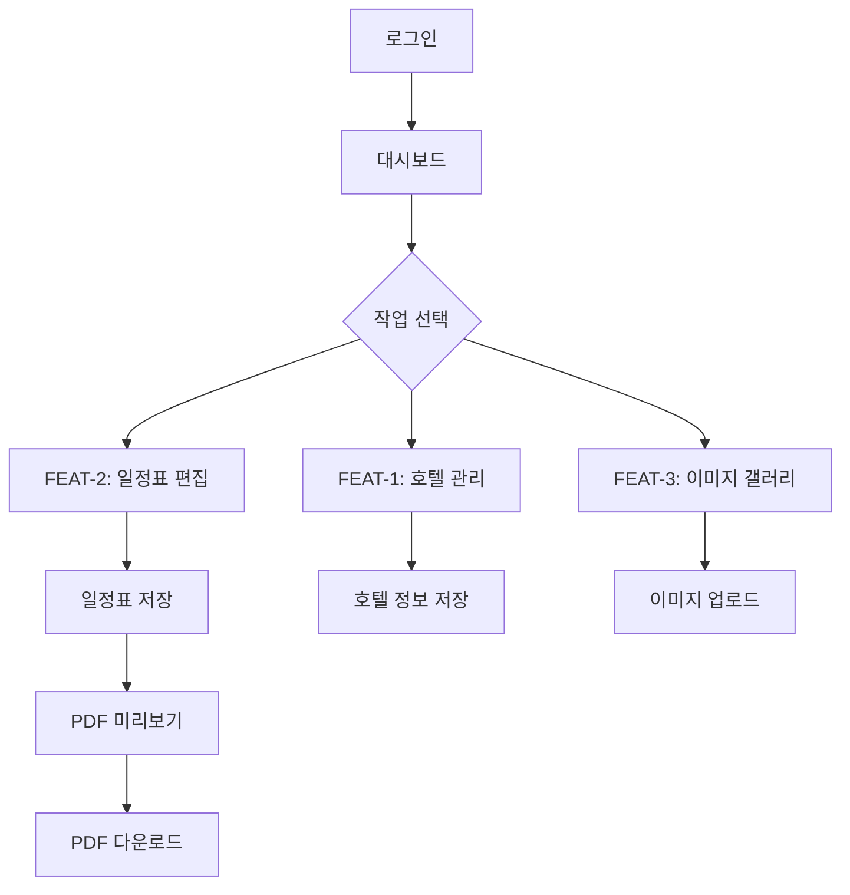
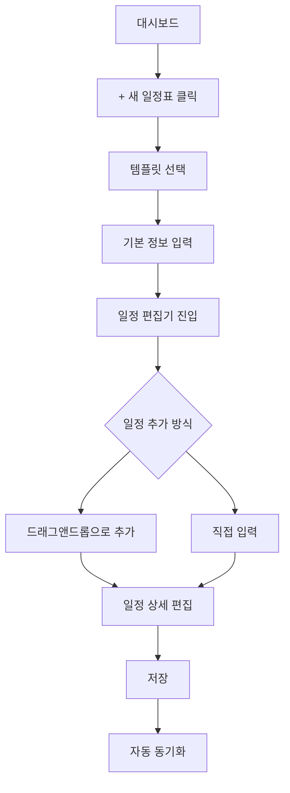

# User Flow: Travel World CMS

## MVP 캡슐

| 항목 | 내용 |
|------|------|
| **목표** | 여행 데이터 입력 → PDF 브로슈어 출력 올인원 도구 |
| **페르소나** | 여행사 대표/관리자 |
| **핵심 기능** | FEAT-2: 일정표 편집기 |

---

## 1. 전체 사용자 흐름



---

## 2. FEAT-0: 공통 흐름 (온보딩/로그인)

### 2.1 첫 방문 시
```
1. 랜딩 페이지 진입
2. 로그인 버튼 클릭
3. 계정 생성 또는 로그인
4. 대시보드 이동
5. 빠른 시작 가이드 표시 (스킵 가능)
```

### 2.2 재방문 시
```
1. 자동 로그인 (토큰 유효 시)
2. 대시보드로 바로 이동
3. 최근 작업 목록 표시
```

---

## 3. FEAT-2: 일정표 편집 흐름 (최우선)

### 3.1 새 일정표 생성



### 3.2 일정 편집 상세 흐름

```
1. 일정 편집기 진입
2. 날짜 선택 (캘린더 뷰)
3. 시간대 클릭 → 새 일정 추가
4. 일정 정보 입력:
   - 시간 (시작/종료)
   - 장소 (지도에서 선택 가능)
   - 설명
   - 이미지 첨부 (갤러리에서 선택)
5. 저장 → 로컬 저장 + 클라우드 동기화
6. 미리보기 → PDF 생성 (v2)
```

### 3.3 기존 일정표 수정

```
1. 대시보드 → 일정표 목록
2. 수정할 일정표 클릭
3. 편집 모드 진입
4. 드래그앤드롭으로 일정 순서 변경
5. 개별 일정 클릭 → 상세 수정
6. 저장
```

---

## 4. FEAT-1: 호텔 관리 흐름

### 4.1 호텔 등록

```
1. 사이드바 → 호텔 관리
2. "+ 새 호텔" 클릭
3. 호텔 정보 입력:
   - 호텔명
   - 주소 (구글 지도 연동)
   - 등급 (별점)
   - 연락처
   - URL
   - 위치/비고 정보
4. 이미지 업로드 (드래그앤드롭)
5. 저장
```

### 4.2 호텔 정보 수정

```
1. 호텔 목록에서 호텔 선택
2. 정보 수정
3. 저장 → 연결된 일정표에 자동 반영
```

---

## 5. FEAT-3: 이미지 갤러리 흐름

### 5.1 이미지 업로드

```
1. 사이드바 → 이미지 갤러리
2. 드래그앤드롭 또는 파일 선택
3. 카테고리 지정 (호텔/관광지/음식 등)
4. 메타데이터 입력 (선택)
5. 업로드 → 클라우드 동기화
```

### 5.2 일정표에 이미지 삽입

```
1. 일정 편집 중 → 이미지 추가 버튼
2. 갤러리에서 이미지 선택
3. 일정에 이미지 삽입
4. 크기/위치 조정 (드래그앤드롭)
```

---

## 6. 고객 상담 시나리오 (핵심 사용 케이스)

### 6.1 맞춤 일정표 빠른 생성

```
상황: 고객이 전화로 여행 상담 요청

1. [10초] 새 일정표 생성 (템플릿 선택)
2. [30초] 기존 호텔 데이터에서 선택
3. [1분] 일정 드래그앤드롭으로 구성
4. [30초] 갤러리에서 이미지 삽입
5. [10초] PDF 다운로드 (v2)
6. [즉시] 고객에게 이메일 전송

→ 총 소요시간: 약 3분 (목표: 5분 이내 ✅)
```

---

## 7. 오프라인 시나리오

```
1. 인터넷 연결 끊김 감지
2. "오프라인 모드" 알림 표시
3. 로컬 데이터로 계속 작업 가능
4. 변경사항 로컬에 저장
5. 인터넷 복구 시 자동 동기화
6. 충돌 발생 시 사용자에게 선택 요청
```

---

## 8. 에러 처리 흐름

| 상황 | 대응 |
|------|------|
| 저장 실패 | 재시도 버튼 + 로컬 백업 유지 |
| 이미지 업로드 실패 | 큐에 저장 후 자동 재시도 |
| 동기화 충돌 | 두 버전 비교 화면 표시 |
| 세션 만료 | 재로그인 안내 (작업 데이터 유지) |
