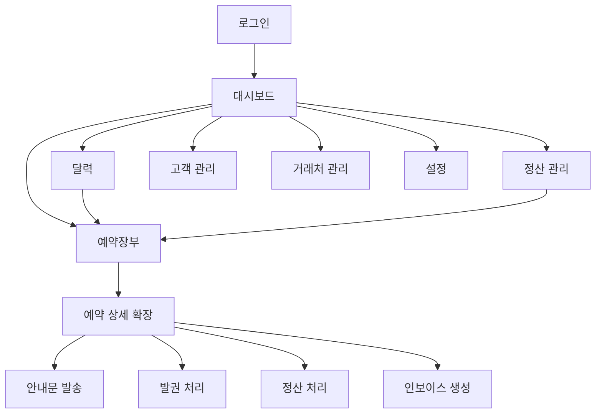

# 항공 예약 관리 시스템 사용자 플로우

## 1. 메인 플로우



## 2. 화면별 플로우

### 화면 1: 로그인 (/login)
- **진입**: 앱 시작
- **행동**: ID/PW 입력 → 로그인
- **이탈**: 대시보드로 이동

### 화면 2: 대시보드 (/dashboard)
- **진입**: 로그인 후 기본 화면
- **행동**:
  - 7일 롤링 달력에서 마감일 확인
  - 오늘 할 일 목록 확인
  - 긴급 항목(빨간색) 우선 처리
- **이탈**: 항목 클릭 → 예약장부 (해당 건 하이라이트)

### 화면 3: 예약장부 (/bookings)
- **진입**: 대시보드에서 클릭 / 사이드바
- **행동**:
  - PNR 텍스트 붙여넣기 → 자동 파싱 → 예약 등록
  - 테이블에서 예약 목록 조회 (필터/검색)
  - 행 클릭 → 확장 (상세 정보 + 액션 버튼)
  - [안내문 발송] [발권] [정산] [인보이스] 버튼 클릭
- **이탈**: 사이드바로 다른 화면 이동

### 화면 4: 달력 (/calendar)
- **진입**: 사이드바
- **행동**:
  - 월간 달력에서 NMTL/TL/BSP 마감일 확인
  - 색상 구분: 🔴빨강(긴급), 🟡노랑(임박), 🟢초록(완료)
  - 날짜 클릭 → 해당 날짜 예약 필터
- **이탈**: 날짜 클릭 → 예약장부 (해당 날짜 필터)

### 화면 5: 정산 관리 (/settlements)
- **진입**: 사이드바 / 예약 상세에서 정산 버튼
- **행동**:
  - 미수/입금완료/카드 현황 필터
  - 정산 상태 변경
  - 인보이스 발행
- **이탈**: 사이드바 / 예약장부

### 화면 6: 고객 관리 (/customers)
- **진입**: 사이드바 / 예약 상세에서 고객명 클릭
- **행동**: 고객 정보 조회/편집, 예약 이력 확인
- **이탈**: 사이드바

### 화면 7: 거래처 관리 (/vendors)
- **진입**: 사이드바
- **행동**: 여행사/항공사 정보 관리
- **이탈**: 사이드바

### 화면 8: 설정 (/settings)
- **진입**: 사이드바
- **행동**: BSP 입금일 등록, 알림 설정, 계정 관리, 큰 글씨 모드 토글
- **이탈**: 사이드바

## 3. 핵심 시나리오

### 시나리오 1: 아침 출근 루틴
```
1. 로그인
2. 대시보드에서 오늘 마감 항목 확인 (빨간색 항목 우선)
3. 빨간색 NMTL 항목 클릭 → 예약장부 이동
4. 해당 예약 확장 → 탑승객 정보 입력 완료
5. 다음 빨간색 항목 처리
6. 오늘 할 일 모두 완료
```

### 시나리오 2: 새 예약 등록
```
1. 예약장부 화면에서 [+ 새 예약] 클릭
2. PNR 텍스트 붙여넣기
3. 자동 파싱된 정보 확인 → 저장
4. NMTL/TL 날짜 자동으로 달력에 표시됨
5. 고객에게 영문이름 확인 안내문 발송
```

### 시나리오 3: 정산 처리
```
1. 예약 확정 후 고객에게 안내문 발송
2. 입금 확인 → 예약장부에서 정산 상태 변경
3. 발권 처리
4. 거래처 인보이스 생성 → 발행
5. BSP 입금일에 알림 수신 → 정산 완료
```

## 4. 예외 플로우

- **로그인 실패 시**: 에러 메시지 표시, 3회 실패 시 잠금
- **PNR 파싱 실패 시**: 수동 입력 폼 제공
- **네트워크 에러 시**: 오프라인 알림 + 재시도 버튼
- **알림 미확인 시**: 대시보드에 미확인 알림 배지 표시
