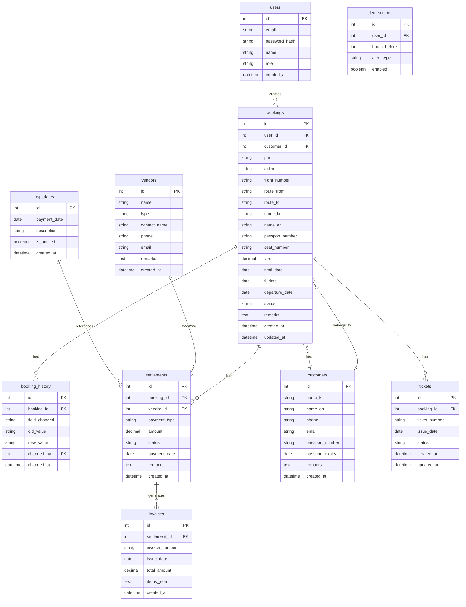

# 항공 예약 관리 시스템 데이터베이스 설계

## 1. ERD

## 2. 테이블 정의

### bookings (예약장부)

| 컬럼 | 타입 | 제약 | 설명 |
|------|------|------|------|
| id | INTEGER | PK, AUTOINCREMENT | 기본키 |
| user_id | INTEGER | FK → users.id | 등록자 |
| customer_id | INTEGER | FK → customers.id | 고객 |
| pnr | TEXT | NOT NULL | PNR 번호 |
| airline | TEXT | | 항공사 코드 |
| flight_number | TEXT | | 항공편 번호 |
| route_from | TEXT | | 출발지 (공항코드) |
| route_to | TEXT | | 도착지 (공항코드) |
| name_kr | TEXT | | 고객명 한글 |
| name_en | TEXT | | 고객명 영문 |
| passport_number | TEXT | | 여권번호 |
| seat_number | TEXT | | 좌석번호 |
| fare | REAL | | 운임 |
| nmtl_date | TEXT | | NMTL 마감일 (YYYY-MM-DD) |
| tl_date | TEXT | | TL 마감일 (YYYY-MM-DD) |
| departure_date | TEXT | | 출발일 (YYYY-MM-DD) |
| status | TEXT | DEFAULT 'pending' | 상태 (pending/confirmed/ticketed/cancelled) |
| remarks | TEXT | | 비고 |
| created_at | TEXT | DEFAULT CURRENT_TIMESTAMP | 생성일 |
| updated_at | TEXT | DEFAULT CURRENT_TIMESTAMP | 수정일 |

### settlements (정산)

| 컬럼 | 타입 | 제약 | 설명 |
|------|------|------|------|
| id | INTEGER | PK | 기본키 |
| booking_id | INTEGER | FK → bookings.id | 예약 |
| vendor_id | INTEGER | FK → vendors.id, NULL | 거래처 |
| payment_type | TEXT | | 결제유형 (cash/card/transfer) |
| amount | REAL | | 금액 |
| status | TEXT | DEFAULT 'unpaid' | 상태 (unpaid/paid/partial) |
| payment_date | TEXT | | 결제일 |
| remarks | TEXT | | 비고 |
| created_at | TEXT | DEFAULT CURRENT_TIMESTAMP | 생성일 |

### tickets (티켓번호)

| 컬럼 | 타입 | 제약 | 설명 |
|------|------|------|------|
| id | INTEGER | PK, AUTOINCREMENT | 기본키 |
| booking_id | INTEGER | FK → bookings.id, NOT NULL | 예약 |
| ticket_number | TEXT | NOT NULL | 티켓번호 (예: 180-1234567890) |
| issue_date | TEXT | | 발권일 (YYYY-MM-DD) |
| status | TEXT | DEFAULT 'issued' | 상태 (issued/refunded/reissued/void) |
| created_at | TEXT | DEFAULT CURRENT_TIMESTAMP | 생성일 |
| updated_at | TEXT | DEFAULT CURRENT_TIMESTAMP | 수정일 |

> **보관 정책**: 연결된 booking의 departure_date 기준 5년 경과 시 자동 삭제

## 3. 인덱스

- `bookings.pnr` — PNR 검색
- `bookings.nmtl_date` — NMTL 마감일 조회
- `bookings.tl_date` — TL 마감일 조회
- `bookings.departure_date` — 출발일 조회
- `bookings.status` — 상태 필터
- `bookings.customer_id` — 고객별 예약 조회
- `settlements.status` — 정산 상태 필터
- `bsp_dates.payment_date` — BSP 입금일 조회
- `tickets.booking_id` — 예약별 티켓 조회
- `tickets.ticket_number` — 티켓번호 검색
- `tickets.status` — 티켓 상태 필터

## 4. 제약 조건

- **Foreign Key**: bookings → users, bookings → customers, tickets → bookings, settlements → bookings, settlements → vendors
- **Unique**: users.email, invoices.invoice_number
- **Status Enum**: bookings.status IN ('pending', 'confirmed', 'ticketed', 'cancelled')
- **Settlement Status**: settlements.status IN ('unpaid', 'paid', 'partial')
- **Ticket Status**: tickets.status IN ('issued', 'refunded', 'reissued', 'void')
- **Retention Policy**: tickets + bookings — departure_date 기준 5년 초과 시 자동 삭제 (스케줄러)
