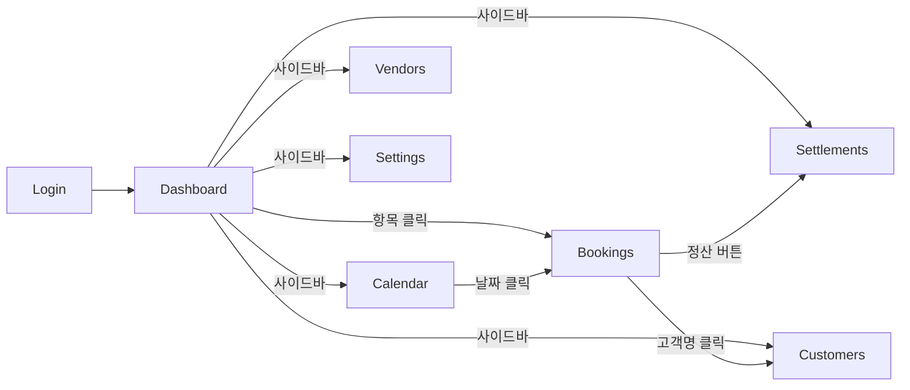

# 항공 예약 관리 시스템 화면 목록

## 화면 1: 로그인
- **ID**: screen-login
- **경로**: /login
- **기능**: 사용자 인증
- **컴포넌트**: LoginForm, EmailInput, PasswordInput, SubmitButton

## 화면 2: 대시보드
- **ID**: screen-dashboard
- **경로**: /dashboard (기본 진입점)
- **기능**: 7일 롤링 달력 + 오늘 할 일 목록
- **컴포넌트**:
  - WeeklyCalendarStrip (7일 롤링, 색상 구분)
  - TodoList (오늘 마감 항목, 긴급도 정렬)
  - StatusBadge (🔴긴급/🟡임박/🟢완료)
  - QuickActions (바로가기 버튼)

## 화면 3: 예약장부
- **ID**: screen-bookings
- **경로**: /bookings
- **기능**: 예약 목록 조회, PNR 파싱 등록, 상세 확장
- **컴포넌트**:
  - PnrInput (PNR 텍스트 붙여넣기 → 자동 파싱)
  - BookingTable (테이블 목록, 정렬/필터/검색)
  - BookingRow (행 — 클릭 시 확장)
  - BookingDetail (확장 패널 — 상세 정보)
  - TicketList (탑승객 이름 클릭 → 티켓번호 목록)
    - TicketRow (티켓번호, 발권일, 상태 표시)
    - TicketAddButton (티켓 수동 추가)
    - TicketStatusBadge (발권/환불/재발행/VOID)
  - ActionButtons ([안내문 발송] [발권] [정산] [인보이스])
  - StatusFilter (상태별 필터)
  - SearchBar (고객명/PNR 검색)

## 화면 4: 달력
- **ID**: screen-calendar
- **경로**: /calendar
- **기능**: 월간 달력 뷰, NMTL/TL/BSP 마감일 표시
- **컴포넌트**:
  - MonthlyCalendar (FullCalendar 기반 월간 뷰)
  - EventMarker (색상별 이벤트 마커)
  - EventList (선택 날짜의 이벤트 목록)
  - CalendarFilter (NMTL/TL/BSP/출발일 필터)

## 화면 5: 정산 관리
- **ID**: screen-settlements
- **경로**: /settlements
- **기능**: 정산 현황 관리, 인보이스 발행
- **컴포넌트**:
  - SettlementTable (정산 목록)
  - SettlementFilter (미수/입금/카드/전체)
  - PaymentForm (결제 정보 입력)
  - InvoiceGenerator (인보이스 생성)
  - SettlementSummary (요약 — 총 미수/입금 완료 금액)

## 화면 6: 고객 관리
- **ID**: screen-customers
- **경로**: /customers
- **기능**: 고객 정보 관리, 예약 이력 조회
- **컴포넌트**:
  - CustomerTable (고객 목록)
  - CustomerForm (고객 정보 입력/편집)
  - BookingHistory (해당 고객의 예약 이력)
  - CustomerSearch (이름/여권번호 검색)

## 화면 7: 거래처 관리
- **ID**: screen-vendors
- **경로**: /vendors
- **기능**: 여행사/항공사 정보 관리
- **컴포넌트**:
  - VendorTable (거래처 목록)
  - VendorForm (거래처 정보 입력/편집)
  - VendorTypeFilter (여행사/항공사 필터)

## 화면 8: 설정
- **ID**: screen-settings
- **경로**: /settings
- **기능**: BSP 입금일 관리, 알림 설정, 계정 관리, UI 설정
- **컴포넌트**:
  - BspDateManager (BSP 입금일 등록/삭제)
  - AlertSettings (알림 시간 설정 — 24시간 전/12시간 전 등)
  - AccountSettings (비밀번호 변경)
  - UISettings (큰 글씨 모드, 다크모드 토글)

---

## 화면 간 이동

## 공통 컴포넌트

- **Sidebar**: 네비게이션 (모든 화면에서 접근)
- **Header**: 페이지 타이틀 + 사용자 정보
- **Toast**: 알림 메시지
- **Modal**: 확인/삭제 다이얼로그
- **StatusBadge**: 상태 표시 (색상 + 텍스트)
- **LoadingSpinner**: 로딩 표시
