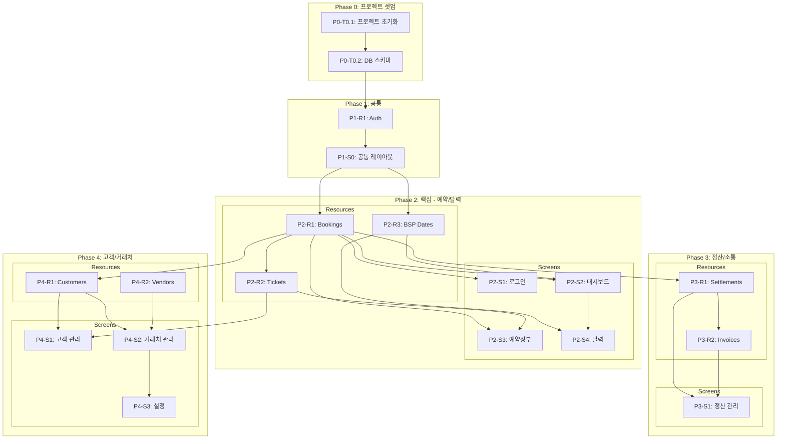

# 항공 예약 관리 시스템 - TASKS

> Domain-Guarded 화면 단위 태스크 | v2.0
> 생성일: 2026-03-15 (티켓번호 관리 기능 추가 반영)

## Interface Contract Validation

```
✅ PASSED — Coverage 100%

Resource        │ Fields │ Screens Using
────────────────┼────────┼──────────────────────────────────
users           │ 6/6 ✅ │ login, settings
bookings        │ 20/20✅│ dashboard, bookings, calendar, settlements, customers
tickets         │ 5/5 ✅ │ bookings, customers
customers       │ 8/8 ✅ │ bookings, customers
settlements     │ 8/8 ✅ │ settlements
invoices        │ 5/5 ✅ │ settlements
vendors         │ 7/7 ✅ │ vendors, settlements
bsp_dates       │ 4/4 ✅ │ dashboard, calendar, settings
alert_settings  │ 4/4 ✅ │ settings
booking_history │ 6/6 ✅ │ (내부 사용)

Total: 10 resources, 8 screens, 100% coverage
```

---

## 의존성 그래프



---

## Phase 0: 프로젝트 셋업

### [ ] P0-T0.1: 프로젝트 초기화
- **담당**: backend-specialist
- **작업**:
  - Next.js 14 + TypeScript 프로젝트 생성
  - 디렉토리 구조 설정 (src/app, src/components, src/lib)
  - ESLint, Prettier 설정
  - Tailwind CSS + 디자인 토큰 설정
  - 환경변수 설정 (.env.local)
- **파일**: `package.json`, `tsconfig.json`, `tailwind.config.ts`
- **TDD**: N/A (셋업)

### [ ] P0-T0.2: DB 스키마 및 마이그레이션
- **담당**: database-specialist
- **작업**:
  - SQLite 데이터베이스 생성
  - 10개 테이블 스키마 생성 (users, bookings, tickets, customers, settlements, invoices, vendors, bsp_dates, alert_settings, booking_history)
  - tickets 테이블: 5년 보관 정책 (departure_date 기준 자동 삭제 스케줄러)
  - 인덱스 생성 (pnr, nmtl_date, tl_date, departure_date, ticket_number 등)
  - 시드 데이터 (관리자 계정, BSP 입금일 샘플)
- **파일**: `prisma/schema.prisma` 또는 `src/lib/db/schema.ts`
- **의존**: P0-T0.1

---

## Phase 1: 공통

### P1-R1: Auth Resource

#### [ ] P1-R1-T1: Auth API 구현
- **담당**: backend-specialist
- **리소스**: users
- **엔드포인트**:
  - POST /api/auth/login (로그인)
  - POST /api/auth/logout (로그아웃)
  - GET /api/auth/me (현재 사용자)
- **필드**: id, email, password_hash, name, role
- **파일**: `tests/api/auth.test.ts` → `src/app/api/auth/route.ts`
- **TDD**: RED → GREEN → REFACTOR
- **의존**: P0-T0.2

### P1-S0: 공통 레이아웃

#### [ ] P1-S0-T1: 공통 레이아웃 UI 구현
- **담당**: frontend-specialist
- **컴포넌트**:
  - Sidebar (네비게이션 — 7개 메뉴)
  - Header (페이지 타이틀 + 사용자 정보 + 로그아웃)
  - Toast (알림 메시지)
  - Modal (확인/삭제 다이얼로그)
  - StatusBadge (긴급/임박/완료/취소)
  - TicketStatusBadge (발권/환불/재발행/VOID)
  - LoadingSpinner
- **디자인**: 큰 글씨 모드 (16px 기본), 다크모드 토글, Pretendard 폰트
- **파일**: `src/components/layout/`, `src/components/ui/`
- **TDD**: RED → GREEN → REFACTOR
- **의존**: P1-R1-T1

---

## Phase 2: 핵심 — 예약/달력

### Resource 태스크

#### P2-R1: Bookings Resource

##### [ ] P2-R1-T1: Bookings API 구현
- **담당**: backend-specialist
- **리소스**: bookings
- **엔드포인트**:
  - GET /api/bookings (목록 — 필터: status, search, page)
  - GET /api/bookings/:id (상세)
  - POST /api/bookings (PNR 파싱 → 자동 등록)
  - PUT /api/bookings/:id (수정)
  - DELETE /api/bookings/:id (삭제)
- **필드**: id, user_id, customer_id, pnr, airline, flight_number, route_from, route_to, name_kr, name_en, passport_number, seat_number, fare, nmtl_date, tl_date, departure_date, status, remarks
- **특수**: PNR 텍스트 파싱 로직 (아바쿠스/토파즈 형식)
- **파일**: `tests/api/bookings.test.ts` → `src/app/api/bookings/route.ts`
- **TDD**: RED → GREEN → REFACTOR
- **병렬**: P2-R3-T1과 병렬 가능
- **의존**: P1-R1-T1

#### P2-R2: Tickets Resource

##### [ ] P2-R2-T1: Tickets API 구현
- **담당**: backend-specialist
- **리소스**: tickets
- **엔드포인트**:
  - GET /api/bookings/:bookingId/tickets (예약별 티켓 목록)
  - POST /api/bookings/:bookingId/tickets (티켓 추가)
  - PUT /api/tickets/:id (티켓 상태 변경)
  - DELETE /api/tickets/:id (티켓 삭제)
- **필드**: id, booking_id, ticket_number, issue_date, status (issued/refunded/reissued/void)
- **보관 정책**: departure_date 기준 5년, 자동 삭제 스케줄러
- **특수**: PNR 파싱 시 티켓번호 자동 추출 (발권 완료된 경우)
- **파일**: `tests/api/tickets.test.ts` → `src/app/api/bookings/[id]/tickets/route.ts`
- **TDD**: RED → GREEN → REFACTOR
- **의존**: P2-R1-T1

#### P2-R3: BSP Dates Resource

##### [ ] P2-R3-T1: BSP Dates API 구현
- **담당**: backend-specialist
- **리소스**: bsp_dates
- **엔드포인트**:
  - GET /api/bsp-dates (목록 — 필터: month, year)
  - POST /api/bsp-dates (등록)
  - DELETE /api/bsp-dates/:id (삭제)
- **필드**: id, payment_date, description, is_notified
- **파일**: `tests/api/bsp-dates.test.ts` → `src/app/api/bsp-dates/route.ts`
- **TDD**: RED → GREEN → REFACTOR
- **병렬**: P2-R1-T1과 병렬 가능
- **의존**: P1-R1-T1

---

### Screen 태스크

#### P2-S1: 로그인 화면

##### [ ] P2-S1-T1: 로그인 UI 구현
- **담당**: frontend-specialist
- **화면**: /login
- **컴포넌트**: LoginForm (이메일/비밀번호 입력 + 제출)
- **데이터 요구**: users (auth)
- **파일**: `tests/pages/Login.test.tsx` → `src/app/login/page.tsx`
- **TDD**: RED → GREEN → REFACTOR
- **의존**: P1-R1-T1, P1-S0-T1

##### [ ] P2-S1-V: 로그인 연결점 검증
- **담당**: test-specialist
- **검증 항목**:
  - [ ] POST /api/auth/login 응답 정상
  - [ ] 로그인 성공 → /dashboard 이동
  - [ ] 로그인 실패 → 에러 메시지
- **파일**: `tests/integration/login.verify.ts`
- **의존**: P2-S1-T1

---

#### P2-S2: 대시보드 화면

##### [ ] P2-S2-T1: 대시보드 UI 구현
- **담당**: frontend-specialist
- **화면**: /dashboard (기본 진입점)
- **컴포넌트**:
  - WeeklyCalendarStrip (7일 롤링, 색상 구분)
  - TodoList (오늘 마감 항목, 긴급도 정렬)
  - StatusBadge (긴급/임박/완료)
  - QuickActions (바로가기 버튼)
- **데이터 요구**: bookings (date_range: today+7d), bsp_dates
- **파일**: `tests/pages/Dashboard.test.tsx` → `src/app/dashboard/page.tsx`
- **TDD**: RED → GREEN → REFACTOR
- **의존**: P2-R1-T1, P2-R3-T1, P1-S0-T1

##### [ ] P2-S2-V: 대시보드 연결점 검증
- **담당**: test-specialist
- **검증 항목**:
  - [ ] Field Coverage: bookings.[id,pnr,name_kr,nmtl_date,tl_date,departure_date,status] 존재
  - [ ] Field Coverage: bsp_dates.[payment_date,description] 존재
  - [ ] Navigation: todo_list → /bookings 이동
  - [ ] 긴급 항목 빨간색 배지 표시
- **파일**: `tests/integration/dashboard.verify.ts`
- **의존**: P2-S2-T1

---

#### P2-S3: 예약장부 화면

##### [ ] P2-S3-T1: 예약장부 UI 구현
- **담당**: frontend-specialist
- **화면**: /bookings
- **컴포넌트**:
  - PnrInput (PNR 텍스트 붙여넣기 → 자동 파싱)
  - SearchBar (고객명/PNR 검색)
  - StatusFilter (전체/대기/확정/발권/취소)
  - BookingTable (예약 목록 테이블)
  - BookingDetail (확장 패널 — 상세 정보)
  - **TicketList** (탑승객 이름 클릭 → 티켓번호 목록)
  - **TicketRow** (티켓번호, 발권일, 상태 배지)
  - **TicketAddButton** (티켓 수동 추가 폼)
  - ActionButtons (안내문/발권/정산/인보이스)
- **데이터 요구**: bookings, tickets, customers
- **파일**: `tests/pages/Bookings.test.tsx` → `src/app/bookings/page.tsx`
- **TDD**: RED → GREEN → REFACTOR
- **의존**: P2-R1-T1, P2-R2-T1, P1-S0-T1

##### [ ] P2-S3-T2: 예약장부 통합 테스트
- **담당**: test-specialist
- **화면**: /bookings
- **시나리오**:
  | 이름 | When | Then |
  |------|------|------|
  | PNR 파싱 등록 | PNR 텍스트 붙여넣기 후 등록 | 예약 자동 등록 + 티켓번호 추출 |
  | 탑승객→티켓 | 예약 확장 후 탑승객 이름 클릭 | 티켓번호 목록 표시 |
  | 티켓 수동 추가 | 티켓 추가 버튼 클릭 | 번호/발권일/상태 입력 폼 |
  | 상태 필터링 | 발권 필터 클릭 | 발권 상태만 표시 |
  | 검색 | 고객명 입력 | 해당 고객 예약만 표시 |
- **파일**: `tests/e2e/bookings.spec.ts`
- **의존**: P2-S3-T1

##### [ ] P2-S3-V: 예약장부 연결점 검증
- **담당**: test-specialist
- **검증 항목**:
  - [ ] Field Coverage: bookings.[전체 20개 필드] 존재
  - [ ] Field Coverage: tickets.[id,booking_id,ticket_number,issue_date,status] 존재
  - [ ] Endpoint: GET /api/bookings 응답 정상
  - [ ] Endpoint: GET /api/bookings/:id/tickets 응답 정상
  - [ ] Endpoint: POST /api/bookings/:id/tickets 정상
  - [ ] Navigation: action_buttons → /settlements 이동
  - [ ] Navigation: booking_detail → /customers 이동
- **파일**: `tests/integration/bookings.verify.ts`
- **의존**: P2-S3-T2

---

#### P2-S4: 달력 화면

##### [ ] P2-S4-T1: 달력 UI 구현
- **담당**: frontend-specialist
- **화면**: /calendar
- **컴포넌트**:
  - MonthlyCalendar (FullCalendar 기반 월간 뷰)
  - EventMarker (NMTL=빨강, TL=노랑, BSP=파랑, 출발=초록)
  - EventList (선택 날짜 이벤트 목록)
  - CalendarFilter (유형별 필터)
- **데이터 요구**: bookings (month/year 필터), bsp_dates
- **파일**: `tests/pages/Calendar.test.tsx` → `src/app/calendar/page.tsx`
- **TDD**: RED → GREEN → REFACTOR
- **의존**: P2-R1-T1, P2-R3-T1, P1-S0-T1

##### [ ] P2-S4-V: 달력 연결점 검증
- **담당**: test-specialist
- **검증 항목**:
  - [ ] Field Coverage: bookings.[nmtl_date,tl_date,departure_date] 존재
  - [ ] Field Coverage: bsp_dates.[payment_date] 존재
  - [ ] Navigation: event_list → /bookings 이동
  - [ ] 색상 구분: NMTL(빨강)/TL(노랑)/BSP(파랑)/출발(초록)
- **파일**: `tests/integration/calendar.verify.ts`
- **의존**: P2-S4-T1

---

## Phase 3: 정산/소통

### Resource 태스크

#### P3-R1: Settlements Resource

##### [ ] P3-R1-T1: Settlements API 구현
- **담당**: backend-specialist
- **리소스**: settlements
- **엔드포인트**:
  - GET /api/settlements (목록 — 필터: status, page)
  - POST /api/settlements (등록)
  - PUT /api/settlements/:id (수정)
- **필드**: id, booking_id, vendor_id, payment_type, amount, status, payment_date, remarks
- **파일**: `tests/api/settlements.test.ts` → `src/app/api/settlements/route.ts`
- **TDD**: RED → GREEN → REFACTOR
- **의존**: P2-R1-T1

#### P3-R2: Invoices Resource

##### [ ] P3-R2-T1: Invoices API 구현
- **담당**: backend-specialist
- **리소스**: invoices
- **엔드포인트**:
  - GET /api/invoices (목록)
  - POST /api/invoices (생성)
  - GET /api/invoices/:id/pdf (PDF 다운로드)
- **필드**: id, settlement_id, invoice_number, issue_date, total_amount, items_json
- **파일**: `tests/api/invoices.test.ts` → `src/app/api/invoices/route.ts`
- **TDD**: RED → GREEN → REFACTOR
- **병렬**: P3-R1-T1 완료 후
- **의존**: P3-R1-T1

---

### Screen 태스크

#### P3-S1: 정산 관리 화면

##### [ ] P3-S1-T1: 정산 관리 UI 구현
- **담당**: frontend-specialist
- **화면**: /settlements
- **컴포넌트**:
  - SettlementSummary (미수/입금 요약)
  - SettlementFilter (미수/입금/카드/전체)
  - SettlementTable (정산 목록)
  - PaymentForm (결제 입력 — 오버레이)
  - InvoiceGenerator (인보이스 생성 — 오버레이)
- **데이터 요구**: settlements, invoices, bookings, vendors
- **파일**: `tests/pages/Settlements.test.tsx` → `src/app/settlements/page.tsx`
- **TDD**: RED → GREEN → REFACTOR
- **의존**: P3-R1-T1, P3-R2-T1, P1-S0-T1

##### [ ] P3-S1-V: 정산 관리 연결점 검증
- **담당**: test-specialist
- **검증 항목**:
  - [ ] Field Coverage: settlements.[전체 8개 필드] 존재
  - [ ] Field Coverage: invoices.[invoice_number,total_amount] 존재
  - [ ] Endpoint: GET /api/settlements 응답 정상
  - [ ] Endpoint: POST /api/invoices 응답 정상
  - [ ] Navigation: settlement_table → /bookings 이동
- **파일**: `tests/integration/settlements.verify.ts`
- **의존**: P3-S1-T1

---

## Phase 4: 고객/거래처/설정

### Resource 태스크

#### P4-R1: Customers Resource

##### [ ] P4-R1-T1: Customers API 구현
- **담당**: backend-specialist
- **리소스**: customers
- **엔드포인트**:
  - GET /api/customers (목록 — 필터: search, page)
  - GET /api/customers/:id (상세 + 예약 이력)
  - POST /api/customers (등록)
  - PUT /api/customers/:id (수정)
- **필드**: id, name_kr, name_en, phone, email, passport_number, passport_expiry, remarks
- **파일**: `tests/api/customers.test.ts` → `src/app/api/customers/route.ts`
- **TDD**: RED → GREEN → REFACTOR
- **병렬**: P4-R2-T1과 병렬 가능
- **의존**: P2-R1-T1

#### P4-R2: Vendors Resource

##### [ ] P4-R2-T1: Vendors API 구현
- **담당**: backend-specialist
- **리소스**: vendors
- **엔드포인트**:
  - GET /api/vendors (목록 — 필터: type, page)
  - POST /api/vendors (등록)
  - PUT /api/vendors/:id (수정)
- **필드**: id, name, type, contact_name, phone, email, remarks
- **파일**: `tests/api/vendors.test.ts` → `src/app/api/vendors/route.ts`
- **TDD**: RED → GREEN → REFACTOR
- **병렬**: P4-R1-T1과 병렬 가능
- **의존**: P1-R1-T1

---

### Screen 태스크

#### P4-S1: 고객 관리 화면

##### [ ] P4-S1-T1: 고객 관리 UI 구현
- **담당**: frontend-specialist
- **화면**: /customers
- **컴포넌트**:
  - CustomerSearch (이름/여권번호 검색)
  - CustomerTable (고객 목록)
  - CustomerForm (고객 정보 입력/편집 — 오버레이)
  - BookingHistory (예약 이력 + 티켓번호 조회)
- **데이터 요구**: customers, bookings, tickets
- **파일**: `tests/pages/Customers.test.tsx` → `src/app/customers/page.tsx`
- **TDD**: RED → GREEN → REFACTOR
- **의존**: P4-R1-T1, P2-R2-T1, P1-S0-T1

##### [ ] P4-S1-V: 고객 관리 연결점 검증
- **담당**: test-specialist
- **검증 항목**:
  - [ ] Field Coverage: customers.[전체 8개 필드] 존재
  - [ ] Field Coverage: tickets.[ticket_number,status] 존재
  - [ ] Endpoint: GET /api/customers 응답 정상
  - [ ] Navigation: booking_history → /bookings 이동
- **파일**: `tests/integration/customers.verify.ts`
- **의존**: P4-S1-T1

---

#### P4-S2: 거래처 관리 화면

##### [ ] P4-S2-T1: 거래처 관리 UI 구현
- **담당**: frontend-specialist
- **화면**: /vendors
- **컴포넌트**:
  - VendorTypeFilter (여행사/항공사 필터)
  - VendorTable (거래처 목록)
  - VendorForm (거래처 정보 입력/편집 — 오버레이)
- **데이터 요구**: vendors
- **파일**: `tests/pages/Vendors.test.tsx` → `src/app/vendors/page.tsx`
- **TDD**: RED → GREEN → REFACTOR
- **의존**: P4-R2-T1, P1-S0-T1

##### [ ] P4-S2-V: 거래처 관리 연결점 검증
- **담당**: test-specialist
- **검증 항목**:
  - [ ] Field Coverage: vendors.[전체 7개 필드] 존재
  - [ ] Endpoint: GET /api/vendors 응답 정상
- **파일**: `tests/integration/vendors.verify.ts`
- **의존**: P4-S2-T1

---

#### P4-S3: 설정 화면

##### [ ] P4-S3-T1: 설정 UI 구현
- **담당**: frontend-specialist
- **화면**: /settings
- **컴포넌트**:
  - BspDateManager (BSP 입금일 등록/삭제)
  - AlertSettings (알림 시간 설정 — ON/OFF 토글)
  - AccountSettings (비밀번호 변경)
  - UISettings (큰 글씨 모드, 다크모드 토글)
- **데이터 요구**: bsp_dates, alert_settings, users
- **파일**: `tests/pages/Settings.test.tsx` → `src/app/settings/page.tsx`
- **TDD**: RED → GREEN → REFACTOR
- **의존**: P2-R3-T1, P1-R1-T1, P1-S0-T1

##### [ ] P4-S3-V: 설정 연결점 검증
- **담당**: test-specialist
- **검증 항목**:
  - [ ] Field Coverage: bsp_dates.[payment_date,description] 존재
  - [ ] Field Coverage: alert_settings.[hours_before,alert_type,enabled] 존재
  - [ ] BSP 입금일 추가 → 달력 자동 반영
  - [ ] 큰 글씨 모드 토글 → 전체 UI 폰트 크기 변경
- **파일**: `tests/integration/settings.verify.ts`
- **의존**: P4-S3-T1

---

## 태스크 요약

| Phase | Resource 태스크 | Screen 태스크 | Verification | 합계 |
|-------|----------------|---------------|-------------|------|
| P0 | - | - | - | 2 |
| P1 | 1 (Auth) | 1 (레이아웃) | - | 2 |
| P2 | 3 (Bookings, Tickets, BSP) | 4 (로그인, 대시보드, 예약장부, 달력) | 4 | 12 |
| P3 | 2 (Settlements, Invoices) | 1 (정산) | 1 | 4 |
| P4 | 2 (Customers, Vendors) | 3 (고객, 거래처, 설정) | 3 | 8 |
| **합계** | **8** | **9** | **8** | **28** |

---

## 실행 순서 요약

```
P0: 프로젝트 초기화 → DB 스키마
    ↓
P1: Auth API → 공통 레이아웃
    ↓
P2: [Bookings API ‖ BSP API] → Tickets API → [로그인 ‖ 대시보드 ‖ 예약장부 ‖ 달력]
    ↓
P3: Settlements API → Invoices API → 정산 관리
    ↓
P4: [Customers API ‖ Vendors API] → [고객 ‖ 거래처 ‖ 설정]
```

‖ = 병렬 실행 가능
